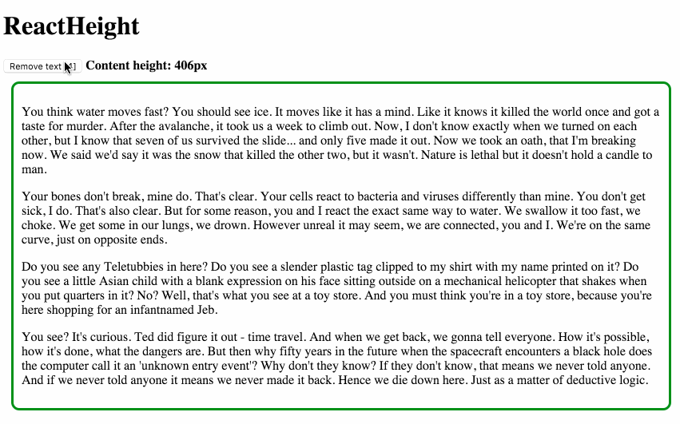

# react-height [](https://www.npmjs.com/package/react-height)

[](https://circleci.com/gh/nkbt/react-height)
[](https://david-dm.org/nkbt/react-height)
[](https://david-dm.org/nkbt/react-height#info=devDependencies)

Component-wrapper to determine and report children elements height

[Live demo](https://www.jinno.io/app/21/?source=react-height)


## Goals

- `react-height` keeps things simple, therefore it does not support nested height change, it only checks immediate children change
- not based on specific browser APIs, so can be used in other environments too



## Live design system demo

[https://www.jinno.io/app/21/](https://www.jinno.io/app/21/?source=react-height)

## Live Demo

[https://www.jinno.io/app/21/](https://www.jinno.io/app/21/?source=react-height)

## Codepen demo

[https://codepen.io/nkbt/pen/NGzgGb](https://codepen.io/nkbt/pen/NGzgGb?editors=101)

## Installation

### NPM

```sh
npm install --save react-height
```

### yarn

```sh
yarn add react-height 
```

### 1998 Script Tag:
```html
<script src="https://unpkg.com/react/umd/react.production.min.js"></script>
<script src="https://unpkg.com/react-height/build/react-height.js"></script>
(Module exposed as `ReactHeight`)
```


## Usage
```js
import {ReactHeight} from 'react-height';

<ReactHeight onHeightReady={height => console.log(height)}>
  <div>Random content</div>
</ReactHeight>
```

## Options


### `onHeightReady`: PropTypes.func.isRequired

Callback, invoked when height is measured (and when it is changed).

### `getElementHeight`: PropTypes.func

Function to measure your element. It receives the element as argument and defaults to `el => el.clientHeight`.

### `children`: PropTypes.node.isRequired

One or multiple children with static, variable or dynamic height.

```js
<ReactHeight onHeightReady={height => console.log(height)}>
  <p>Paragraph of text</p>
  <p>Another paragraph is also OK</p>
  <p>Images and any other content are ok too</p>
  
</ReactHeight>
```


### `hidden`: PropTypes.bool (default: false)

ReactHeight can render to null as soon as height is measured.

```js
<ReactHeight hidden={true} onHeightReady={height => console.log(height)}>
  <div>Will be removed from the DOM when height is measured</div>
</ReactHeight>
```

### Pass-through props

All other props are applied to a container that is being measured. So it is possible to pass `style` or `className`, for example.

```js
<ReactHeight onHeightReady={height => console.log(height)}
  style={{width: 200, border: '1px solid red'}}
  className="myComponent">

  <div>
    Wrapper around this element will have red border, 200px width
    and `class="myComponent"`
  </div>
</ReactHeight>
```


## Development and testing

Currently is being developed and tested with the latest stable `Node` on `OSX`.

To run example covering all `ReactHeight` features, use `yarn start`, which will compile `example/index.js`

```bash
git clone git@github.com:nkbt/react-height.git
cd react-height
yarn install
yarn start

# then
open http://localhost:8080
```

## Tests

```bash
# to run ESLint check
yarn lint

# to run tests
yarn test
```

## License

MIT
